# Devops Tooling Website Solution
## NFS Server
### Network File System (NFS) is a distributed file system protocol originally developed by Sun Microsystems (Sun) in 1984, allowing a user on a client computer to access files over a computer network much like local storage is accessed. NFS, like many other protocols, builds on the Open Network Computing Remote Procedure Call (ONC RPC) system. NFS is an open standard defined in a Request for Comments (RFC), allowing anyone to implement the protocol.

### NFS is a very useful tool but, historically, it has suffered from many limitations, most of which have been addressed with version 4 of the protocol. The downside is that the latest version of NFS is harder to configure when you want to make use of basic security features such as authentication and encryption since it relies on Kerberos for those parts. And without those, the NFS protocol must be restricted to a trusted local network since data goes over the network unencrypted (a sniffer can intercept it) and access rights are granted based on the client's IP address (which can be spoofed).

## As a member of a DevOps team, We will implement a tooling website solution which makes access to DevOps tools within the corporate infrastructure easily accessible.

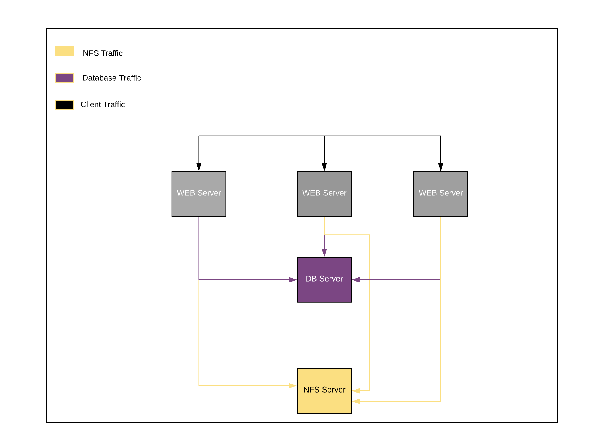

## Step 1 — Prepare the NFS Server
* We need to create a single partition on each of the 3 disks we added to our NFS Server using the command.

```
$ sudo gdisk /dev/sdb
```
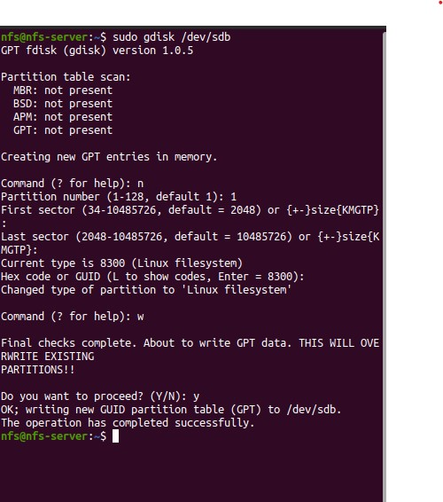

```
$ sudo gdisk /dev/sdc
```
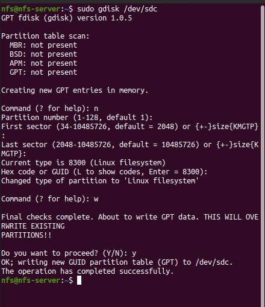

```
$ sudo gdisk /dev/sdd
```
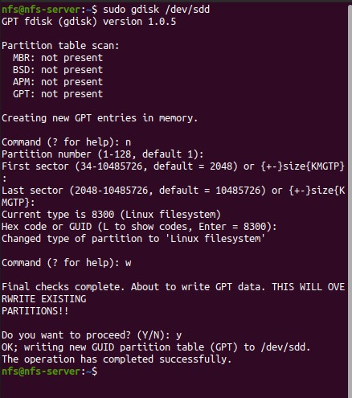

* We need to mark the disks as LVM physical volumes with the command
```
$ sudo pvcreate /dev/sdb1 /dev/sdc1 /dev/sdd1
```

* We need to add the PVs to a volume group. We will Name the VG webdata-vg
```
$ sudo vgcreate nfs-vg /dev/sdb1 /dev/sdc1 /dev/sdd1
```

* We need to create 3 logical volumes *lv-opt* , *lv-apps* and *lv-logs* for out mount.
```
$ sudo lvcreate -L 4.90G -n lv-opt nfs-vg
```
```
$ sudo lvcreate -L 4.90G -n lv-apps nfs-vg
```
```
$ sudo lvcreate -L 4.90G -nlv-logs nfs-vg
```
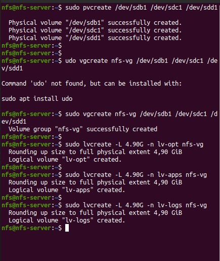

* We need  to format the logical volume with *XFS* filesystem
```
$ sudo mkfs.xfs /dev/nfs-vg/lv-opt
```
```
$ sudo mkfs.xfs /dev/nfs-vg/lv-apps
```
```
sudo mkfs.xfs /dev/nfs-vg/lv-logs
```
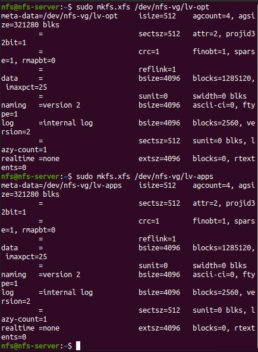

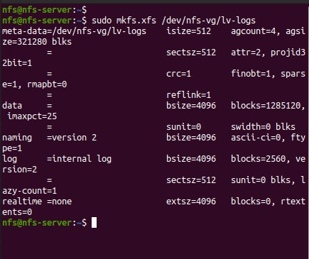

* We need to create mount points on */mnt* directory for the logical volumes: Mount *lv-apps* on */mnt/html* To be used by webservers
```
$ sudo mkdir -p /mnt/html
```

* We need to create mount points on */mnt* directory for the logical volumes: Mount *lv-logs* on */mnt/logs* To be used by webserver logs
```
$ sudo mkdir -p /mnt/logs
```

* We need to create mount points on */mnt* directory for the logical volumes: Mount *lv-opt* on */mnt/opt* To be used by our Jenkins server in later project.
```
$ sudo mkdir -p /mnt/opt
```

* We need to Mount *lv-apps* on */mnt/html* logical volume
```
$ sudo mount /dev/nfs-vg/lv-apps /mnt/html/
```

* We need to Mount *lv-logs* on */mnt/logs* logical volume
```
$ sudo mount /dev/nfs-vg/lv-logs /mnt/logs/
```

* We need to Mount *lv-opt* on */mnt/opt* logical volume
```
$ sudo mount /dev/nfs-vg/lv-opt /mnt/opt/
```

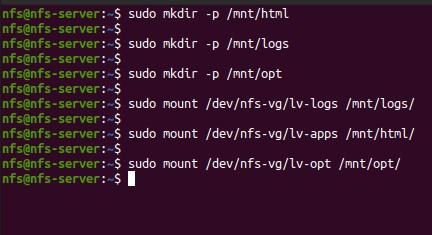

* We will Install and configure NFS server
```
$ sudo apt update
```
```
$ sudo apt install nfs-kernel-server
```
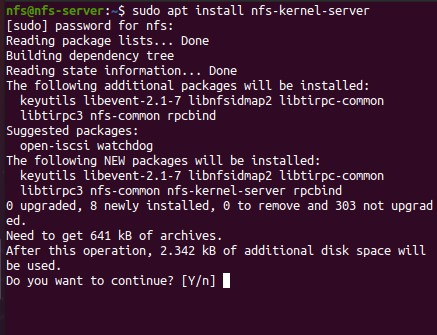

* As we want all clients to access the directory, we will remove restrictive permissions of the export folder through the following commands:
```
$ sudo chown nobody:nogroup /mnt/html
```
```
$ sudo chown nobody:nogroup /mnt/logs
```
```
$ sudo chown nobody:nogroup /mnt/opt
```

* We need all users from all groups on the client system to be able to access our files.
```
$ sudo chmod 755 /mnt/html
```
```
$ sudo chmod 755 /mnt/logs
```
```
$ sudo chmod 755 /mnt/opt
```
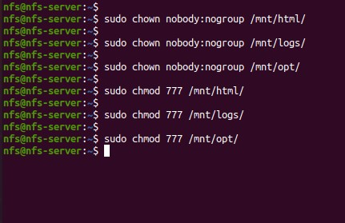

* We need to assign server access to clients through NFS export file
```
$ sudo nano /etc/exports
```
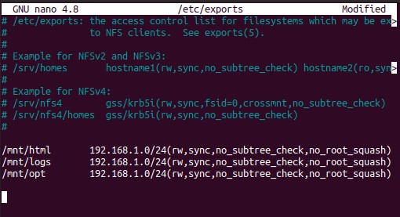

* We need to export the *mnt* directories
```
$ sudo exportfs -a
```

* We can display all exported file systems from our NFS server with the command
```
$ sudo showmount -e ip-address
```
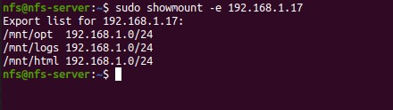

## Step 2 — Configure the database server
* We are going to Install MySQL with the command
```
$ sudo apt-get update
```
```
$ sudo apt -y install mysql-server
```
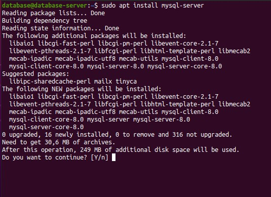

* We are going to configure MySQL with the command
```
$ sudo mysql_secure_installation
```

* We need to create a database and name it *tooling*
```
mysql> CREATE database tooling;
```
### NOTE: While creating the database user password, *CREATE user 'webaccess'@'192.168.1.%' IDENTIFIED by 'password';* This kind of command might not work with some PHP applications because those commands uses *caching_sha2_password* for its password encryption. So we can only use the command below for the creation of the database user password.

* We need to create a database user and name it *webaccess*
```
mysql> CREATE user 'webaccess'@'192.168.1.%' IDENTIFIED WITH mysql_native_password by 'password';
```

* We need to grant permission to *webaccess* user on *tooling* database to do anything only from the webservers
```
mysql> GRANT ALL PRIVILEGES ON tooling.* TO 'webaccess'@'192.168.1.%';
```
```
mysql> FLUSH PRIVILEGES;
```
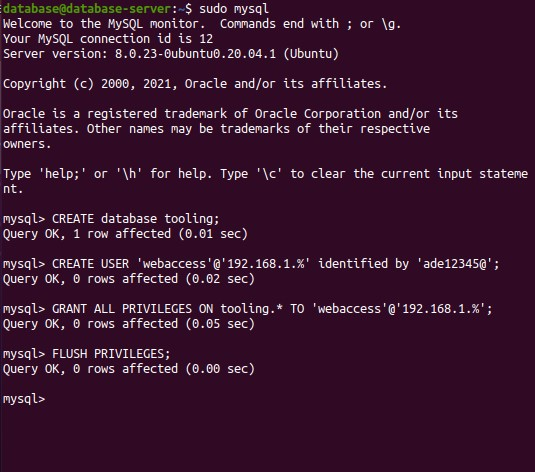

## Step 3 — Prepare the Web Servers
### The webservers will use the NFS as its backend storage. Hence, it is important to configure the web servers as NFS client. We will follow the below steps to prepare each servers.

* We need to update and Install NFS client
```
$ sudo yum update
```
```
$ sudo yum install nfs-utils
```
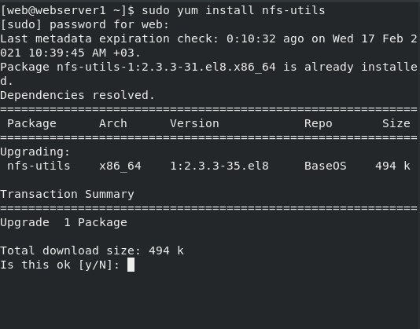
* We are going to Mount /var/www/ and target the NFS server’s export for apps
```
$ sudo mkdir /var/www/
```
```
$ sudo mount -t nfs ip-address:/mnt/html /var/www/
```

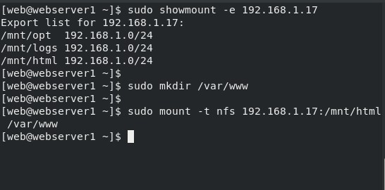

* We need to Install Apache webserver
```
$ sudo yum install httpd
```
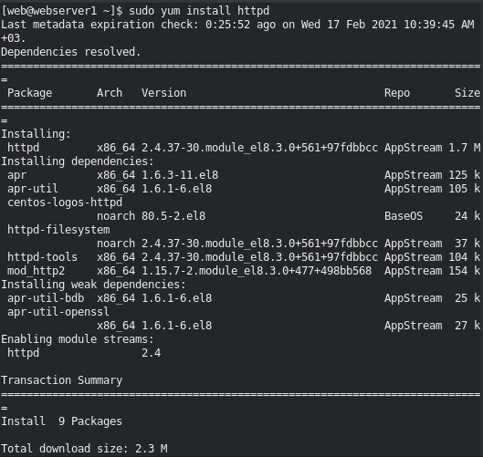

### NOTE: That apache webserver might not be able to start because of the security presently active on our server, You can either disable the SELinux security with this command and turned the **enforcing** to **disabled** and restart the system after that:
```
$ sudo nano /etc/selinux/config
```

* We need to install PHP for our website file
```
$ sudo yum install php
```
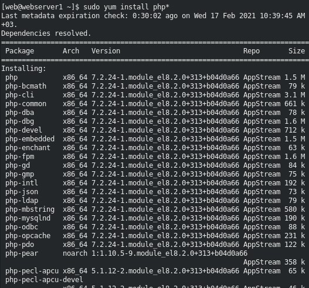

* We need to install git to clone our repository from out github account
```
$ sudo yum install git
```

* We need to install mysql client so as to be able to access our website can access our database server remotely.
```
$ sudo yum install mysql
```

* We need to change the ownership of html folder for Apache
```
sudo chown -R web:apache /var/www/html
```

* We need to change the ownership of log folder for Apache
```
sudo chown -R web:apache /var/log/httpd 
```

* We need to change the permission of the log folder for Apache
```
sudo chmod -R 755 /var/log/httpd 
```

* We need to change the permission of the html folder for Apache
```
sudo chmod -R 755 /var/www/html
```

* we need to locate the log folder for Apache and mount it, targeting the NFS server’s export for logs
```
$ sudo mount -t nfs ip-address:/mnt/logs /var/log/httpd
```


# NOTE
### Got an error trying to login into the database with the user and pass created. But it was noticed that there is a known issue with some versions of PHP that can cause problems with this plugin using *caching_sha2_password*. so we can use *mysql_native_password* to create the password so as to work with our PHP applications.

# CREDIT
* https://www.digitalocean.com/community/tutorials/how-to-allow-remote-access-to-mysql

* https://en.wikipedia.org/wiki/Network_File_System

* https://debian-handbook.info/browse/el-GR/stable/sect.nfs-file-server.html

* https://professional-pbl.darey.io/en/latest/project7.html?next=https%3A%2F%2Fprofessional-pbl.darey.io%2Fen%2Flatest%2Fproject7.html&ticket=ST-1613373900-E7z6rr8ZsKSYKl91HG0xVTgGOA